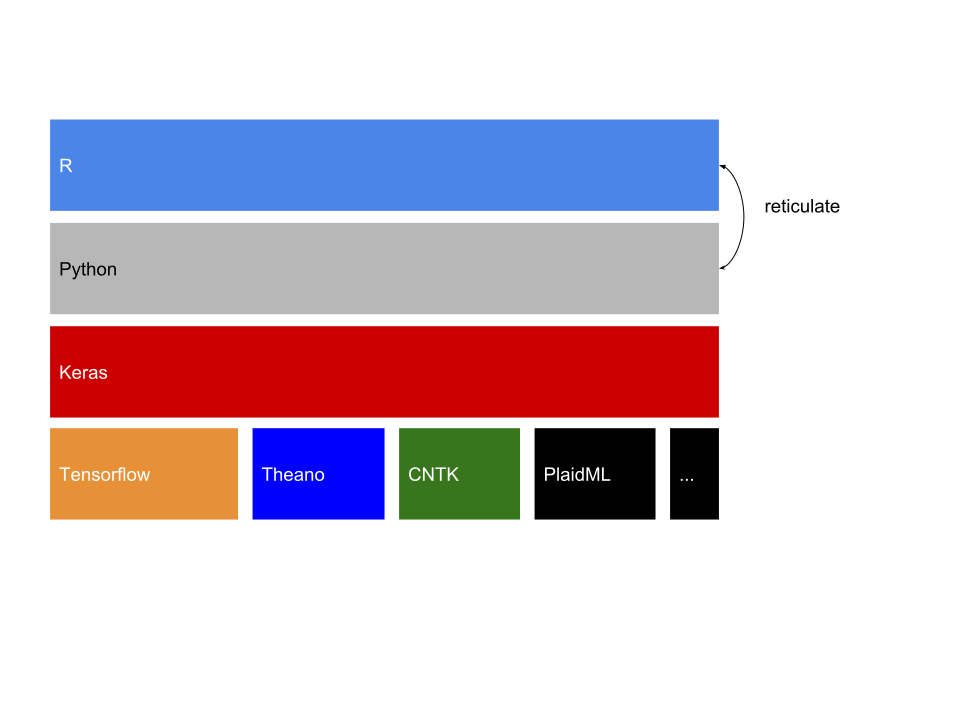
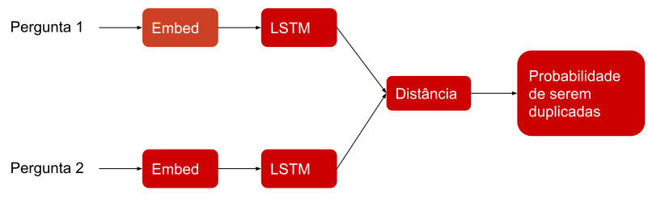
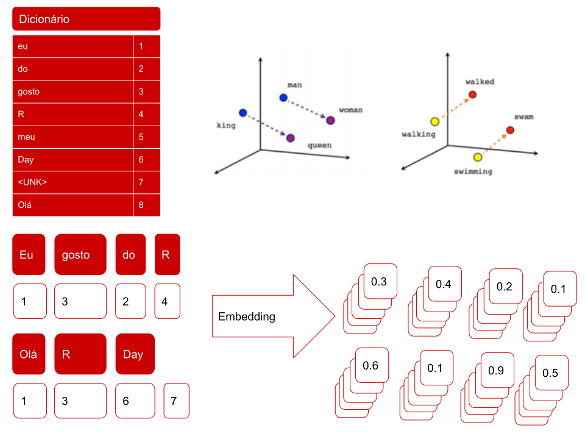
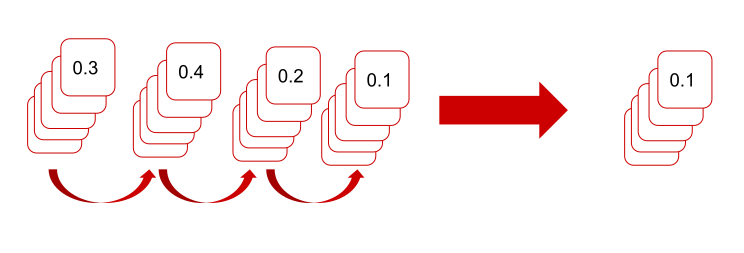
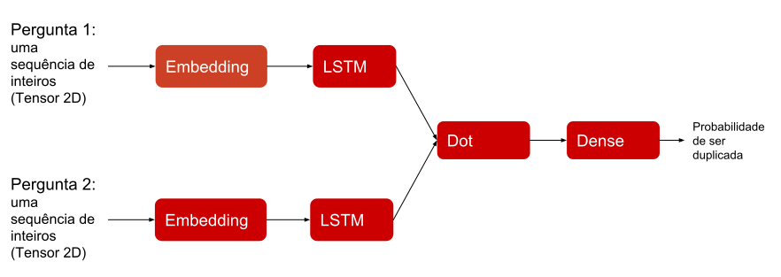

```{r setup, include=FALSE}
options(htmltools.dir.version = FALSE)
```

## Oi!

- Bacharel em Estatística (2015)

- Sócio da [Curso-R](http://curso-r.com)

- Sócio da [R6](http://rseis.com.br)

---

## Deep Learning

* Redes neurais com muitas camadas.

* Recentemente alcançou bastante sucesso em problemas de classificação de imagens, audio e texto.


---

## Keras

* Uma API que permite especificar modelos de *Deep Learning* de forma intuitiva e rápida.

* Criada por François Chollet (@fchollet).


* Originalmente implementada em `python`.

---

## Keras

* Uma API com múltiplas implementações.

```{r echo=FALSE, message=FALSE, warning=FALSE}

```

---

## Keras + R

* Pacote do R: [`keras`](https://github.com/rstudio/keras).

* Baseado em [reticulate](https://github.com/rstudio/reticulate).

* Desenvolvido pelo JJ Allaire (CEO do RStudio).

* Tem uma sintaxe R-like com uso de `%>%`.


---
class: inverse, middle, center

## Exemplo

### [Classifying duplicate questions from Quora with Keras](https://tensorflow.rstudio.com/blog/keras-duplicate-questions-quora.html)

---


* [Quora](https://www.quora.com): site de perguntas e respostas de âmbito geral.

* Para quem usa o Quora, é melhor ter apenas uma versão de uma pergunta.

* Banco de dados de uma [competição do Kaggle](https://www.kaggle.com/c/quora-question-pairs).

* ~400k pares de perguntas duplicadas (ou não) marcadas pelos moderadores do site.

* **Objetivo:** Identificar os pares de perguntas que possuem o mesmo _significado_.

* Antes da competição o problema era resolvido com Random Forests, depois passaram a usar [Deep Learning](https://engineering.quora.com/Semantic-Question-Matching-with-Deep-Learning).

---

### Duplicadas

<div>
.pull-left[
  * How can I be a good geologist?
  
  
  * How do I read and find my YouTube comments? 
  
  * What can make Physics easy to learn?  
]

.pull-right[
  - What should I do to be a great geologist? 
  
  
  - How can I see all my Youtube comments?
  
  - How can you make physics easy to learn? 
]
</div>


### Não-Duplicadas

<div>
.pull-left[
  * How can I increase the speed of my internet connection while using a VPN?	
  
  
  * What is the step by step guide to invest in share market in india?
  
  * How do I get over my ex's past?	

]

.pull-right[
  * How can Internet speed be increased by hacking through DNS?
  
  
  * What is the step by step guide to invest in share market?
  
  * What is the best way to get over your ex?	
]
</div>

---

## Arquitetura do modelo

<br>
<br>

```{r echo=FALSE, message=FALSE, warning=FALSE}

```

* Siamese LSTM

---

#### Embedding

```{r echo=FALSE, message=FALSE, warning=FALSE}

```


---

## LSTM

```{r echo=FALSE, message=FALSE, warning=FALSE}

```

---

## Arquitetura no Keras

<br>
<br>

```{r echo=FALSE, message=FALSE, warning=FALSE}

```

---

## Código

```{r, eval = FALSE}
library(keras)
```

--

```{r, eval = FALSE}
input1 <- layer_input(shape = c(20), name = "input_question1")
input2 <- layer_input(shape = c(20), name = "input_question2")
```

--

```{r, eval = FALSE}
word_embedder <- layer_embedding( 
  input_dim = 50000,     # vocab size 
  output_dim = 128,      # hyperparameter - embedding size
  input_length = 20     # padding size
)
```

--

```{r, eval = FALSE}
seq_embedder <- layer_lstm(units = 128)
```

--

```{r, eval = FALSE}
vector1 <- input1 %>% word_embedder() %>% seq_embedder()
vector2 <- input2 %>% word_embedder() %>% seq_embedder()
```

--

```{r}
#> Tensor("lstm_1/TensorArrayReadV3:0", shape=(?, 128), dtype=float32)
#> Tensor("lstm_1_1/TensorArrayReadV3:0", shape=(?, 128), dtype=float32)
```

---

## Arquitetura do Modelo

<br>
<br>

```{r echo=FALSE, message=FALSE, warning=FALSE}

```

---

## Código

```{r, eval = FALSE}
cosine_similarity <- layer_dot(list(vector1, vector2), axes = 1)
```

--

```{r, eval = FALSE}
output <- cosine_similarity %>% 
  layer_dense(units = 1, activation = "sigmoid")
```

--

```{r, eval = FALSE}
model <- keras_model(list(input1, input2), output)
model %>% compile(
  optimizer = "adam", 
  metrics = list(acc = metric_binary_accuracy), 
  loss = "binary_crossentropy"
)
```

---

```{r, eval = FALSE}
summary(model)
```

```{r, eval = FALSE}
# _______________________________________________________________________________________
# Layer (type)                Output Shape       Param #    Connected to                 
# =======================================================================================
# input_question1 (InputLayer (None, 20)         0                                       
# _______________________________________________________________________________________
# input_question2 (InputLayer (None, 20)         0                                       
# _______________________________________________________________________________________
# embedding_1 (Embedding)     (None, 20, 128)    6400256    input_question1[0][0]        
#                                                           input_question2[0][0]        
# _______________________________________________________________________________________
# lstm_1 (LSTM)               (None, 128)        131584     embedding_1[0][0]            
#                                                           embedding_1[1][0]            
# _______________________________________________________________________________________
# dot_1 (Dot)                 (None, 1)          0          lstm_1[0][0]                 
#                                                           lstm_1[1][0]                 
# _______________________________________________________________________________________
# dense_1 (Dense)             (None, 1)          2          dot_1[0][0]                  
# =======================================================================================
# Total params: 6,531,842
# Trainable params: 6,531,842
# Non-trainable params: 0
# _______________________________________________________________________________________
```

---

## Treinando

```{r, eval = FALSE}
model %>% fit(
  list(train_question1_padded, train_question2_padded),
  train_is_duplicate, 
  batch_size = 64, 
  epochs = 10, 
  validation_data = list(
    list(val_question1_padded, val_question2_padded), 
    val_is_duplicate
  )
)
```

```{r}
# Train on 363861 samples, validate on 40429 samples
# Epoch 1/10
# 363861/363861 [==============================] - 89s 245us/step - loss: 0.5860 - acc: 0.7248 - val_loss: 0.5590 - val_acc: 0.7449
# Epoch 2/10
# 363861/363861 [==============================] - 88s 243us/step - loss: 0.5528 - acc: 0.7461 - val_loss: 0.5472 - val_acc: 0.7510
# Epoch 3/10
# 363861/363861 [==============================] - 88s 242us/step - loss: 0.5428 - acc: 0.7536 - val_loss: 0.5439 - val_acc: 0.7515
```


---
class: inverse, middle, center

## Predições com Shiny

[Shiny](https://jjallaire.shinyapps.io/shiny-quora/)

---

## Mais

* [Galeria de exemplos do Keras](https://keras.rstudio.com/articles/examples/index.html).
* [Livro: Deep Learning com R](https://www.amazon.com/Deep-Learning-R-Francois-Chollet/dp/161729554X)
* [Blog: Tensorflow for R](https://tensorflow.rstudio.com/blog.html)


---
class: inverse, middle, center

## Obrigado

dfalbel@curso-r.com

github.com/dfalbel

rday-keras.curso-r.com


