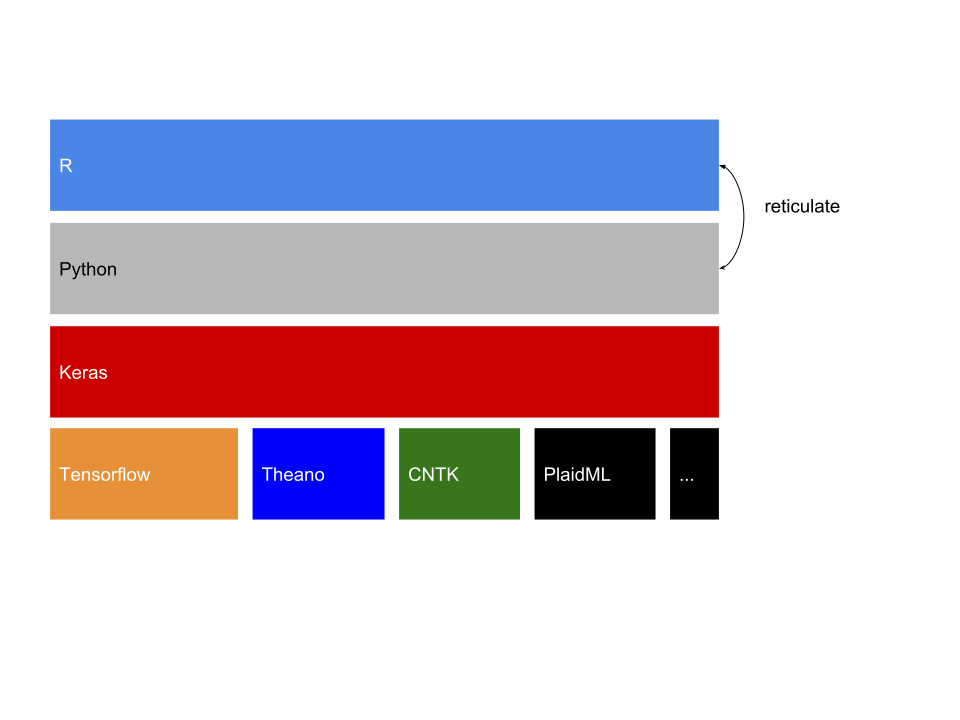
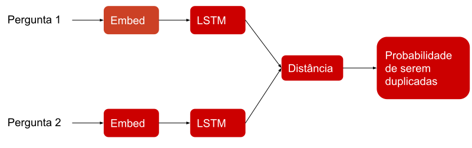

```{r setup, include=FALSE}
options(htmltools.dir.version = FALSE)
```

## Oi!

- Bacharel em Estatística (2015)

- Sócio da [Curso-R](http://curso-r.com)

- Sócio da [R6](http://rseis.com.br)

---

## Deep Learning

* Redes neurais com muitas camadas.

* Recentemente alcançou bastante sucesso em problemas de classificação de imagens, audio e texto.


---

## Keras

* Uma API que permite especificar modelos de *Deep Learning* de forma intuitiva e rápida.

* Criada por François Chollet (@fchollet).


* Originalmente implementada em `python`.

---

## Keras

* Uma API com múltiplas implementações.

```{r echo=FALSE, message=FALSE, warning=FALSE}

```

---

## Tensorflow

.pull-left[

* Desenvolvida por pesquisadores no Google para fazer pesquisas em Deep Learning. O nome original era *DistBelief*.

* Uma biblioteca de computação numérica de propósito geral.
  
* Com a mesma sintaxe funciona em diversos hardwares:
  - CPU (com Eigen)
  - GPU (cum CUDA)
  - TPU (Tensor Processing Unit)
  
]

.pull-right[
  
]

---

## Keras + R

* Pacote do R: [`keras`](https://github.com/rstudio/keras).

* Baseado em [reticulate](https://github.com/rstudio/reticulate).

* Desenvolvido pelo JJ Allaire (CEO do RStudio).

* Tem uma sintaxe R-like com uso de `%>%`.


---
class: inverse, middle, center

## Exemplo

### [Classifying duplicate questions from Quora with Keras](https://tensorflow.rstudio.com/blog/keras-duplicate-questions-quora.html)

---


* [Quora](https://www.quora.com): site de perguntas e respostas de âmbito geral.

* Para quem usa o Quora, é melhor ter apenas uma versão de uma pergunta.

* Banco de dados de uma [competição do Kaggle](https://www.kaggle.com/c/quora-question-pairs).

* ~400k pares de perguntas duplicadas ou não marcadas pelos moderadores do site.

* **Objetivo:** Identificar os pares de perguntas que possuem o mesmo _significado_.

* Antes da competição o problea era resolvido com Random Forests, depois passaram a usar [Deep Learning](https://engineering.quora.com/Semantic-Question-Matching-with-Deep-Learning).

---

### Duplicadas

<div>
.pull-left[
  * How can I be a good geologist?
  
  
  * How do I read and find my YouTube comments? 
  
  * What can make Physics easy to learn?  
]

.pull-right[
  - What should I do to be a great geologist? 
  
  
  - How can I see all my Youtube comments?
  
  - How can you make physics easy to learn? 
]
</div>


### Não-Duplicadas

<div>
.pull-left[
  * How can I increase the speed of my internet connection while using a VPN?	
  
  
  * What is the step by step guide to invest in share market in india?
  
  * How do I get over my ex's past?	

]

.pull-right[
  * How can Internet speed be increased by hacking through DNS?
  
  
  * What is the step by step guide to invest in share market?
  
  * What is the best way to get over your ex?	
]
</div>

---

# Modelo

<br>
<br>

```{r echo=FALSE, message=FALSE, warning=FALSE}

```


